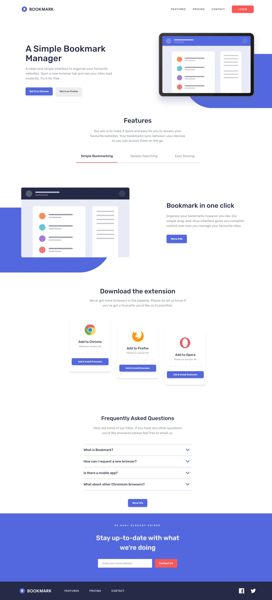

 Frontend Mentor - Bookmark landing page solution

This is a solution to the [Bookmark landing page challenge on Frontend Mentor](https://www.frontendmentor.io/challenges/bookmark-landing-page-5d0b588a9edda32581d29158). Frontend Mentor challenges help you improve your coding skills by building realistic projects. 

## Table of contents

- [Overview](#overview)
  - [The challenge](#the-challenge)
  - [Screenshot](#screenshot)
  - [Links](#links)
- [My process](#my-process)
  - [Built with](#built-with)
  - [What I learned](#what-i-learned)
  - [Continued development](#continued-development)
- [Author](#author)


## Overview

### The challenge

Users should be able to:

- View the optimal layout for the site depending on their device's screen size
- See hover states for all interactive elements on the page
- Receive an error message when the newsletter form is submitted if:
  - The input field is empty
  - The email address is not formatted correctly

### Screenshot




- Solution URL: [Add solution URL here](https://your-solution-url.com)
- Live Site URL: [Add live site URL here](https://your-live-site-url.com)

## My process

### Built with

- Semantic HTML5 markup
- CSS custom properties
- Flexbox
- CSS Grid
- SASS

### What I learned

In this project, I reinforced several important concepts and skills. Here’s a summary of what I gained:


- I explored how the viewBox attribute effectively resizes SVG elements while maintaining their proportions.

- This project provided a practical opportunity to apply my new SCSS knowledge and deepen my understanding.

- I learned about the input event type and became familiar with properties and methods like emailInput.validity, setCustomValidity, preventDefault, and typeMismatch. Here’s a code example demonstrating how I handled email validation:
```js
 if (emailInput.validity.typeMismatch) {
    emailInput.setCustomValidity(""); // Clear any previous custom error
    emailContainer.classList.add("error");
  } 

   if (!emailInput.validity.valid) {
    e.preventDefault();
    emailInput.setCustomValidity("");
    emailContainer.classList.add("error");
  } 
```

### Continued development
I plan to keep refining my SCSS skills for better precision in styling. Additionally, I’m eager to continue my JavaScript learning journey, focusing on making my projects more dynamic and functional.

## Author

- Frontend Mentor - [@SoulOfMo](https://www.frontendmentor.io/profile/SoulOfMo)
- Twitter - [@morin_sultan](https://x.com/morin_sultan)

